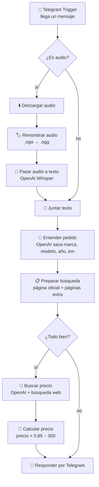

# 🏍️ Cotizador de motos: Telegram → n8n → OpenAI

Le escribes (o le mandas un **audio**) a tu bot de Telegram:

> Tengo el modelo Honda Dio del año 2026 con 5000 km, ¿en qué precio la puedo aceptar?

y el bot te responde:

```
🏍️ Honda Dio 2026 · 5.000 km
✅ Puedes aceptarla en: $1.638

📋 Precio oficial: $2.280 (Honda Dio 110 2026)
🧮 $2.280 − 15 % IVA − $300 = $1.638
🔗 https://motos.honda.com.ec/...
```

Tu n8n: `https://vps-3c0c0def.vps.ovh.ca` · Solo Ecuador · Precios en dólares.

> Los $2.280 del ejemplo son ilustrativos. El bot usa el precio que esté publicado ese día en la página.

---

## 🧠 ¿Cómo funciona? (la idea en simple)

Imagina que tienes un **ayudante en la oficina**:

1. Le cuentas qué moto te ofrecen, por escrito o con una nota de voz.
2. Si es audio, primero lo **escucha y lo escribe**.
3. Anota **marca, modelo, año y kilómetros**.
4. Entra a la **página oficial de esa marca en Ecuador** y busca cuánto cuesta esa moto **nueva**.
5. Hace la cuenta: **precio × 0,85 − $300**. Le quita el 15 % del IVA y $300 de tu ganancia.
6. Te contesta por Telegram con el número y el link de dónde sacó el precio, para que lo compruebes.

Cuenta del ejemplo: $2.280 × 0,85 = $1.938. Luego $1.938 − $300 = **$1.638**.

---

## 🗺️ Diagrama del flujo en n8n



En palabras, cada cuadrito hace una sola cosa y le pasa el trabajo al siguiente:

```
📱 Tú escribes o mandas un audio en Telegram
   ↓
 1. 👂 Telegram Trigger     → "¡Llegó un mensaje!"
 2. ❓ ¿Es audio?           → sí: pasa por 3, 4 y 5 · no: salta al 6
 3. ⬇️ Descargar audio      → baja la nota de voz
 4. 🏷️ Renombrar audio      → le pone un nombre que OpenAI acepta
 5. 🎤 Pasar audio a texto  → "tengo una honda dio 2026..."
 6. 🧩 Juntar texto         → queda el mensaje escrito, venga de donde venga
 7. 🧠 Entender pedido      → "Honda · Dio · 2026 · 5000 km"
 8. 📋 Preparar búsqueda    → "buscar en motos.honda.com.ec"
 9. ❓ ¿Todo bien?          → no: salta al 12 con "No te entendí"
10. 🔎 Buscar precio        → "$2.280"
11. 🧮 Calcular precio      → "$1.638"
12. 💬 Responder            → te lo manda por Telegram
```

---

## ✏️ Lo que TÚ tienes que poner o revisar

El resto lo copias tal cual.

| # | Qué | Dónde se pone | De dónde lo sacas |
|---|-----|---------------|-------------------|
| 1 | Token de un bot **nuevo** | n8n → Credencial *Telegram API* | @BotFather (Paso 1) |
| 2 | Clave de OpenAI (`sk-...`) | n8n → Credencial *OpenAI* | platform.openai.com (Paso 2) |
| 3 | Saldo en OpenAI | platform.openai.com → Billing | Tarjeta de crédito/débito (Paso 2) |
| 4 | Páginas oficiales de cada marca | Nodo *Preparar búsqueda* → `MARCAS` | Ya vienen puestas. Revísalas (Paso 6) |
| 5 | Páginas extra (opcional) | Nodo *Preparar búsqueda* → `PAGINAS_EXTRA` | Las que tú quieras |
| 6 | Quién puede usar el bot (opcional) | Nodo *Preparar búsqueda* → `CHATS_PERMITIDOS` | Sale en la primera prueba |
| 7 | La fórmula (IVA y $300) | Nodo *Calcular precio* → `IVA` y `MARGEN` | Ya está: 15 % y $300 |

---

## Paso 0 – Lo que necesitas

- ✅ Tu celular con Telegram
- ✅ Una tarjeta para ponerle saldo a OpenAI. Con $5 alcanza para empezar y probar.
- ✅ Un computador con tu n8n abierto: `https://vps-3c0c0def.vps.ovh.ca`
- ✅ El archivo `workflow.json`, que está en esta misma carpeta
- ⏱️ Unos 30 minutos.

---

## Paso 1 – Crear un bot NUEVO de Telegram 🤖

⚠️ **No uses el bot de las pastillas.** Telegram solo deja conectar **un** workflow por bot. Si usas el mismo, uno de los dos deja de funcionar.

1. En Telegram busca **BotFather** (el de la palomita azul ✔️) → **Iniciar**.
2. Escribe `/newbot`.
3. **Nombre:** `Cotizador Motos`.
4. **Usuario:** tiene que terminar en `bot`, por ejemplo `cristian_motos_bot`.
5. Copia el **TOKEN** que te da (algo como `123456789:AAH...`). 🔑 No se lo muestres a nadie.
6. Toca el enlace `t.me/tu_bot` y presiona **Iniciar**.

---

## Paso 2 – Sacar tu clave de OpenAI 🔑

OpenAI es la "inteligencia" que escucha los audios, entiende el mensaje y busca el precio en internet.

1. Entra a **https://platform.openai.com** y crea una cuenta o inicia sesión.
   *(Ojo: aunque pagues ChatGPT Plus, esto se paga aparte.)*
2. Arriba a la derecha → **⚙️ Settings** → **Billing** → **Add to credit balance**. Pon **$5**.
3. Entra a **https://platform.openai.com/api-keys** → **+ Create new secret key**.
4. **Nombre:** `n8n-motos` → **Create secret key**.
5. Copia la clave (empieza con `sk-...`). **Solo te la muestra una vez.** Guárdala en tu nota.

💰 Cada consulta cuesta unos pocos centavos, porque la búsqueda en internet se cobra aparte. Puedes ver cuánto llevas gastado en **platform.openai.com → Usage**.

---

## Paso 3 – Guardar las llaves dentro de n8n 🗝️

### 3.1 Telegram
1. Abre `https://vps-3c0c0def.vps.ovh.ca` → **Credentials** → **Add credential**.
2. Busca `Telegram` → **Telegram API**.
3. En **Access Token** pega el token del Paso 1.
4. Cámbiale el nombre arriba a `Telegram Motos`, para no confundirlo con el de pastillas. → **Save** ✅

### 3.2 OpenAI
1. **Add credential** → busca `OpenAI` → elige **OpenAI**.
2. En **API Key** pega tu clave `sk-...`. Lo demás déjalo como está.
3. **Save**. Si sale verde ✅, quedó bien.

---

## Paso 4 – Traer el workflow a n8n 📥

1. Descarga `workflow.json` a tu computador.
2. En n8n: **+ (Create) → Workflow**.
3. Menú **⋯** (arriba a la derecha) → **Import from File...** → elige `workflow.json`.
4. Vas a ver **12 cuadritos** conectados. 🎉

---

## Paso 5 – Ponerle las llaves a cada nodo 🔌

Doble clic en cada nodo con triángulo rojo ⚠️ y elige la credencial:

| Nodo | En **Credential to connect with** elige… |
|------|------|
| **Telegram Trigger** | `Telegram Motos` |
| **Descargar audio** | `Telegram Motos` |
| **Responder** | `Telegram Motos` |
| **Pasar audio a texto** | tu credencial *OpenAI* |
| **Entender pedido** | Authentication ya dice *Predefined Credential Type* → *OpenAI*. Abajo, en el campo **OpenAI**, elige tu credencial |
| **Buscar precio** | Igual que *Entender pedido* |

Al final no debe quedar ningún triángulo rojo. Guarda con **Ctrl + S**.

---

## Paso 6 – Revisar las páginas oficiales 🌐

Doble clic en el nodo **Preparar búsqueda**. Arriba del todo está esta lista:

```js
const MARCAS = {
  'honda':         'motos.honda.com.ec',
  'yamaha':        'yamaha.com.ec',
  'suzuki':        'suzukimotos.ec',
  'kawasaki':      'ecuador.kawasaki-la.com',
  'ktm':           'ktm.com',
  'royal enfield': 'royalenfieldec.com',
  'bajaj':         'bajajecuador.com',
  'shineray':      'shineray.com.ec',
  'akt':           'aktmotos.com',
  'tvs':           'tvsmotor.com',
};
```

1. Abre cada página en tu navegador y fíjate si **muestra precios**. Algunas marcas solo dicen "Cotizar". Para esas, el bot va a buscar en las páginas extra.
2. Si conoces una página oficial mejor, cambia el dominio. Va **sin** `https://` y **sin** nada después de la primera `/`.
   - ✅ `motos.honda.com.ec`
   - ❌ `https://motos.honda.com.ec/productos`
3. ¿Falta una marca? Copia una línea y cámbiala, por ejemplo: `'benelli': 'benelli.com.ec',`

Debajo está la lista de **páginas extra**. El bot busca ahí cuando el precio no aparece en la página oficial:

```js
const PAGINAS_EXTRA = [
  'ecuador.patiotuerca.com',
  'motopower.com.ec',
];
```

Puedes agregar las que quieras (concesionarios, tiendas). Cuando el precio sale de una página extra, el bot te avisa con ⚠️.

---

## Paso 7 – ¡Probar! 🧪

1. En n8n guarda (**Ctrl + S**) y haz clic en **Execute workflow** (abajo al centro). n8n se queda escuchando 👂.
2. Escríbele a tu bot:
   ```
   Tengo una Honda Dio 2026 con 5000 km, ¿en cuánto la acepto?
   ```
3. Los cuadritos se ponen verdes ✅ uno por uno. **La búsqueda puede tardar entre 10 y 40 segundos.** Es normal.
4. El bot te responde con el precio y el link. **Abre el link** y revisa que el precio esté bien.
5. Ahora prueba el **audio**: otra vez **Execute workflow**, y en Telegram mantén presionado el 🎤 y di lo mismo.
   El bot te contesta empezando con *"🎤 Te escuché: «...»"* para que veas qué entendió.
6. Si todo funcionó, arriba a la derecha pon el interruptor en **Active** (o **Publish**). 🟢
   Desde ahora funciona **siempre**, aunque apagues el computador.

---

## 📝 Cómo escribirle al bot

Lo importante es la **marca** y el **modelo**. El año y los km son opcionales.

| Mensaje | Qué hace |
|---|---|
| `Tengo una Honda Dio 2026 con 5000 km` | Busca la Dio en la página de Honda |
| `Me ofrecen una KTM Duke 200 del 2023 con 8 mil km` | Busca la Duke 200 |
| 🎤 *"una roya enfil clásic 350 del 2024"* | Entiende "Royal Enfield Classic 350" aunque esté mal dicho |
| `Yamaha FZ` | Funciona sin año ni km |
| `hola` | Te explica cómo escribirle |

---

## 🧮 La fórmula

```
Precio para aceptarla = precio oficial × (1 − 0,15) − 300
```

Está en el nodo **Calcular precio**, en las primeras líneas:

```js
const IVA = 0.15;     // 15 % de IVA en Ecuador
const MARGEN = 300;   // dólares que restas para tu ganancia
```

Si algún día cambia el IVA o quieres ganar más, cambias solo esos números.

⚠️ En esta versión base **el año y los km no cambian el precio**. Una Dio 2026 con 5.000 km y una con 40.000 km dan el mismo número. Lo mejoramos en la siguiente versión (ver *Próximas mejoras*).

---

## 📘 ¿Y Facebook Marketplace?

Por ahora **no se puede** de forma segura:

- Marketplace pide **iniciar sesión** con una cuenta de Facebook para ver los anuncios.
- Facebook **prohíbe** que robots lean su página y **bloquea las cuentas** que lo hacen.
- La búsqueda de OpenAI tampoco puede entrar ahí.

👉 La alternativa es **Patiotuerca** (`ecuador.patiotuerca.com`), que es pública y ya viene en `PAGINAS_EXTRA`. Si encuentras otra página pública de motos en Ecuador, agrégala ahí.

---

## 🆘 Si algo sale mal

| Problema | Solución |
|---|---|
| El **Telegram Trigger** da error de *webhook* o *HTTPS* | En el VPS, en la configuración de n8n (`.env` o `docker-compose.yml`), revisa que esté `WEBHOOK_URL=https://vps-3c0c0def.vps.ovh.ca/` y reinicia n8n. Es lo mismo que hiciste con el bot de pastillas. |
| El bot de pastillas **dejó de funcionar** | Usaste el mismo bot en los dos workflows. Crea un bot nuevo (Paso 1). |
| El bot responde *"No pude conectarme con OpenAI"* | La clave está mal copiada o **no tienes saldo**. Revisa platform.openai.com → Billing. |
| *"No pude buscar el precio (error de OpenAI)"* | Abre la última ejecución (**Executions**) → nodo **Buscar precio** y lee el error. Si dice que el modelo no existe o no admite `web_search`, cambia el modelo en el nodo **Juntar texto**: `const MODELO = 'gpt-5-mini';` |
| Muchas veces dice *"No encontré el precio"* | Esa marca no publica precios en su página. Abre la página y compruébalo. Agrega páginas extra (Paso 6). |
| El precio está **mal** | Abre el link 🔗 que te mandó el bot. Si la página tiene dos precios (normal y promoción), el bot usa el más bajo y te lo dice con 📝. |
| El audio no funciona | Abre la ejecución en **Executions** y mira el nodo **Pasar audio a texto**. Manda audios cortos (menos de 1 minuto) y hablando claro. |
| Funciona en prueba pero **no cuando está activo** | Revisa que el interruptor esté en **Active**. |

---

## 🔒 Extra (opcional): que solo TÚ puedas usar el bot

Cada consulta gasta tu saldo de OpenAI. Si no quieres que otras personas lo usen:

1. Haz una prueba y abre el nodo **Telegram Trigger**. En la salida busca `message → chat → id`, un número como `987654321`.
2. En el nodo **Preparar búsqueda**, cambia:
   ```js
   const CHATS_PERMITIDOS = [987654321];
   ```
   Para varias personas, sepáralos con comas: `[987654321, 111111111]`.
3. Guarda. Si otra persona le escribe, el bot le contesta *"🔒 Este bot es privado"* y le dice su número, para que tú lo agregues si quieres.

---

## 🚀 Próximas mejoras (para la versión 2)

1. **Descontar por año y kilometraje**: por ejemplo, −8 % por cada año de uso y −$X por cada 10.000 km.
2. **Mensaje de espera**: que el bot diga *"🔎 Buscando..."* mientras trabaja.
3. **Guardar cada consulta en Google Sheets**, para tener historial de motos cotizadas.
4. **Precio de referencia de usadas**: comparar con lo que piden en Patiotuerca por motos del mismo año.
5. **Respuesta en audio**: que el bot te conteste con voz.

---

## 📎 Anexo: armar el workflow a mano (si no lo importaste)

> Lo más fácil es importar `workflow.json` (Paso 4). Esto es por si quieres entender cada pieza o armarla tú.

### Nodo 1 – Telegram Trigger
`+` → **Telegram** → **On message**. Credential: `Telegram Motos`. **Updates:** `message`.

### Nodo 2 – If (nombre: `¿Es audio?`)
Condición: valor `{{ !!($json.message.voice || $json.message.audio) }}` · **Boolean → is true**.
- Salida **true** → Nodo 3.
- Salida **false** → Nodo 6.

### Nodo 3 – Telegram (nombre: `Descargar audio`)
**Telegram → File → Get**.
- **File ID:** `{{ ($json.message.voice || $json.message.audio).file_id }}`
- **Download:** encendido.

### Nodo 4 – Code (nombre: `Renombrar audio`)
**Code**, modo *Run Once for All Items*, JavaScript:

```js
// Las notas de voz de Telegram llegan como ".oga" y OpenAI no siempre acepta ese nombre.
// Es el mismo audio (formato Ogg): solo le cambiamos el nombre a ".ogg".
const item = $input.first();
const audio = item.binary.data;
if (/\.oga$/i.test(audio.fileName || '')) {
  audio.fileName = audio.fileName.replace(/\.oga$/i, '.ogg');
  audio.fileExtension = 'ogg';
  audio.mimeType = 'audio/ogg';
}
return [item];
```

### Nodo 5 – OpenAI (nombre: `Pasar audio a texto`)
**OpenAI → Audio → Transcribe a Recording**.
- **Input Data Field Name:** `data`
- **Options → Language of the Audio File:** `es`
- Pestaña **Settings** → **On Error:** *Continue*.

### Nodo 6 – Code (nombre: `Juntar texto`)
Recibe flechas de los nodos 2 (salida *false*) y 5.

```js
// ===== Modelo de OpenAI que usa el bot (si lo cambias, cámbialo solo aquí) =====
const MODELO = 'gpt-5.4-mini';
// ===============================================================================

const msg = $('Telegram Trigger').first().json.message;     // el mensaje original de Telegram
const entrada = $input.first().json;                         // si fue audio, aquí viene lo transcrito
const esAudio = !!(msg.voice || msg.audio);
const texto = ((esAudio ? entrada.text : msg.text) || '').trim();

// Pedido para OpenAI: que saque marca, modelo, año y km del mensaje
const peticion = {
  model: MODELO,
  instructions:
    'Eres el asistente de un negocio de motos en Ecuador. Del mensaje del cliente saca la marca, ' +
    'el modelo, el año y el kilometraje de la motocicleta. ' +
    'La marca va en minúsculas y sin tildes (honda, yamaha, suzuki, kawasaki, ktm, royal enfield, bajaj, shineray, akt, tvs...). ' +
    'Corrige errores de dictado o de escritura (ej.: "ka te eme" = ktm, "roya enfil" = royal enfield). ' +
    'El modelo va sin la marca (ej.: "Dio", "Classic 350", "Duke 200"). ' +
    'Si un dato no aparece, pon null. Si el mensaje no habla de una moto, pon todo en null.',
  input: texto || '(mensaje vacío)',
  text: {
    format: {
      type: 'json_schema',
      name: 'pedido',
      strict: true,
      schema: {
        type: 'object',
        additionalProperties: false,
        required: ['marca', 'modelo', 'anio', 'km'],
        properties: {
          marca: { type: ['string', 'null'] },
          modelo: { type: ['string', 'null'] },
          anio: { type: ['integer', 'null'] },
          km: { type: ['integer', 'null'] },
        },
      },
    },
  },
};

return [{ json: { chatId: msg.chat.id, texto, esAudio, modelo: MODELO, peticion } }];
```

### Nodo 7 – HTTP Request (nombre: `Entender pedido`)
- **Method:** `POST`
- **URL:** `https://api.openai.com/v1/responses`
- **Authentication:** *Predefined Credential Type* → **Credential Type:** *OpenAI* → tu credencial.
- **Send Body:** encendido · **Body Content Type:** JSON · **Specify Body:** *Using JSON*
- **JSON:** `{{ JSON.stringify($json.peticion) }}`
- **Options → Timeout:** `120000`
- Pestaña **Settings** → **On Error:** *Continue*.

### Nodo 8 – Code (nombre: `Preparar búsqueda`)

```js
// ===== 1) PÁGINA OFICIAL DE CADA MARCA EN ECUADOR =====
// Solo el dominio: sin https:// y sin nada después de la primera "/".
// Para agregar una marca, copia una línea y cámbiala.
const MARCAS = {
  'honda':         'motos.honda.com.ec',
  'yamaha':        'yamaha.com.ec',
  'suzuki':        'suzukimotos.ec',
  'kawasaki':      'ecuador.kawasaki-la.com',
  'ktm':           'ktm.com',               // KTM no tiene dominio propio en Ecuador (su página es ktm.com/es-ec)
  'royal enfield': 'royalenfieldec.com',
  'bajaj':         'bajajecuador.com',
  'shineray':      'shineray.com.ec',
  'akt':           'aktmotos.com',
  'tvs':           'tvsmotor.com',
};

// ===== 2) PÁGINAS EXTRA: si el precio no está en la oficial, busca aquí =====
// Agrega las que quieras, una por línea y entre comillas.
const PAGINAS_EXTRA = [
  'ecuador.patiotuerca.com',
  'motopower.com.ec',
];

// ===== 3) (Opcional) QUIÉN PUEDE USAR EL BOT =====
// Vacío = cualquiera. Ejemplo: [111111111, 987654321]
const CHATS_PERMITIDOS = [];
// =================================================

const base = $('Juntar texto').first().json;
const r = $input.first().json;                     // respuesta de OpenAI (Entender pedido)
const { chatId, texto, esAudio } = base;
const AYUDA = 'Escríbeme o mándame un audio así:\n«Tengo una Honda Dio 2026 con 5000 km, ¿en cuánto la acepto?»';

function salir(respuesta) {
  return [{ json: { ok: false, chatId, respuesta } }];
}
function textoDeOpenAI(res) {
  let t = '';
  for (const item of res.output || [])
    if (item.type === 'message')
      for (const c of item.content || []) if (c.type === 'output_text') t = c.text;
  return t;
}
const normal = (s) =>
  String(s || '').toLowerCase().normalize('NFD').replace(/[̀-ͯ]/g, '').replace(/[^a-z0-9]/g, '');
// "royal enfield" → "Royal Enfield"; marcas cortas en mayúsculas: "ktm" → "KTM"
const capital = (s) => String(s).replace(/\S+/g, (p) => (p.length <= 3 ? p.toUpperCase() : p[0].toUpperCase() + p.slice(1)));

if (CHATS_PERMITIDOS.length && !CHATS_PERMITIDOS.map(String).includes(String(chatId))) {
  return salir(`🔒 Este bot es privado.\nTu número de chat es: ${chatId}`);
}
if (!texto) {
  return salir(esAudio ? 'No pude escuchar tu audio 😅 Inténtalo otra vez o escríbeme.' : `Hola 👋 ${AYUDA}`);
}
if (r.error) {
  return salir('⚠️ No pude conectarme con OpenAI. Revisa tu clave y que tengas saldo.');
}

let pedido = {};
try { pedido = JSON.parse(textoDeOpenAI(r)) || {}; } catch (e) {}

const escuche = esAudio ? `🎤 Te escuché: «${texto}»\n\n` : '';
if (!pedido.marca || !pedido.modelo) {
  return salir(`${escuche}No te entendí 😅 Necesito por lo menos la marca y el modelo.\n${AYUDA}`);
}

const clave = Object.keys(MARCAS).find((m) => normal(m) === normal(pedido.marca));
const oficial = clave ? MARCAS[clave] : null;
const dominios = [...new Set([oficial, ...PAGINAS_EXTRA].filter(Boolean))];
const marca = capital(clave || pedido.marca);

if (!dominios.length) {
  return salir(`${escuche}La marca ${marca} no está en mi lista de páginas oficiales.\nAgrégala en la tabla MARCAS del nodo "Preparar búsqueda".`);
}

const moto = `${marca} ${pedido.modelo}${pedido.anio ? ' ' + pedido.anio : ''}`;
const instrucciones = [
  `Busca en internet el precio de venta al público en Ecuador, en dólares (USD), de la motocicleta NUEVA (0 km): ${moto}.`,
  oficial
    ? `Búscalo primero en la página oficial de la marca: ${oficial}. Solo si ahí no aparece el precio, búscalo en: ${PAGINAS_EXTRA.join(', ')}.`
    : `Esta marca no tiene página oficial registrada. Búscalo en: ${PAGINAS_EXTRA.join(', ')}.`,
  'Reglas:',
  '- Usa la búsqueda web. NO respondas de memoria y NO inventes precios.',
  '- Solo precio de moto nueva. Ignora anuncios de motos usadas.',
  '- Si el año pedido no aparece, usa el modelo más reciente publicado y dilo en "modelo_encontrado".',
  '- Si hay varias versiones, elige la más parecida a lo que pidió el cliente.',
  '- Si ves precio normal y precio de promoción, usa el más bajo y explícalo en "nota".',
  'Responde SOLO con este JSON, sin texto adicional:',
  '{"encontrado": true o false, "precio": número sin puntos ni símbolos (ej. 2280), "modelo_encontrado": "texto", "url": "link donde viste el precio", "nota": "texto corto o vacío"}',
].join('\n');

const peticion = {
  model: base.modelo,
  tools: [
    {
      type: 'web_search',
      filters: { allowed_domains: dominios },
      user_location: { type: 'approximate', country: 'EC' },
    },
  ],
  input: instrucciones,
};

return [{
  json: {
    ok: true, chatId, escuche, marca,
    modelo: pedido.modelo, anio: pedido.anio, km: pedido.km,
    oficial, peticion,
  },
}];
```

### Nodo 9 – If (nombre: `¿Todo bien?`)
Condición: `{{ $json.ok }}` · **Boolean → is true**.
- Salida **true** → Nodo 10.
- Salida **false** → Nodo 12.

### Nodo 10 – HTTP Request (nombre: `Buscar precio`)
Exactamente igual que el Nodo 7.

### Nodo 11 – Code (nombre: `Calcular precio`)

```js
// ===== FÓRMULA (cámbiala aquí si algún día cambia) =====
const IVA = 0.15;     // 15 % de IVA en Ecuador
const MARGEN = 300;   // dólares que restas para tu ganancia
// Precio para aceptarla = precio oficial × (1 − IVA) − MARGEN
// ========================================================

const d = $('Preparar búsqueda').first().json;
const r = $input.first().json;                    // respuesta de OpenAI (Buscar precio)

function salir(respuesta) {
  return [{ json: { chatId: d.chatId, respuesta } }];
}
function textoDeOpenAI(res) {
  let t = '';
  for (const item of res.output || [])
    if (item.type === 'message')
      for (const c of item.content || []) if (c.type === 'output_text') t = c.text;
  return t;
}
function primeraFuente(res) {           // primer link que OpenAI citó
  for (const item of res.output || [])
    for (const c of item.content || [])
      for (const a of c.annotations || []) if (a.type === 'url_citation' && a.url) return a.url;
  return '';
}
function leerJSON(t) {
  const todo = t.match(/\{[\s\S]*\}/);
  try { return JSON.parse(todo[0]); } catch (e) {}
  for (const parte of t.match(/\{[^{}]*\}/g) || []) {
    try { return JSON.parse(parte); } catch (e) {}
  }
  return {};
}
function aNumero(v) {                   // "2.280", "$2,280.00" o 2280 → 2280
  if (typeof v === 'number') return v;
  const s = String(v ?? '').replace(/[^\d.,]/g, '');
  const centavos = s.match(/[.,](\d{1,2})$/);
  const entero = (centavos ? s.slice(0, -centavos[0].length) : s).replace(/[.,]/g, '');
  const n = parseFloat(entero + (centavos ? '.' + centavos[1] : ''));
  return isNaN(n) ? null : n;
}
const miles = (n) => Math.round(n).toString().replace(/\B(?=(\d{3})+(?!\d))/g, '.');
const dinero = (n) => '$' + miles(n);
const dominioDe = (url) => ((String(url).match(/^https?:\/\/([^/?#]+)/i) || [])[1] || '').toLowerCase().replace(/^www\./, '');

const titulo = `🏍️ ${d.marca} ${d.modelo}${d.anio ? ' ' + d.anio : ''}${d.km != null ? ' · ' + miles(d.km) + ' km' : ''}`;

if (r.error) {
  return salir(`${d.escuche}${titulo}\n⚠️ No pude buscar el precio (error de OpenAI). Revisa tu saldo y vuelve a intentar.`);
}

const res = leerJSON(textoDeOpenAI(r));
const precio = aNumero(res.precio);
if (!res.encontrado || !precio) {
  return salir(
    `${d.escuche}${titulo}\n😕 No encontré el precio publicado de esta moto` +
    `${d.oficial ? ' en ' + d.oficial : ''} ni en las páginas extra.\n` +
    'Revisa que el modelo esté bien escrito, o agrega otra página en PAGINAS_EXTRA (nodo "Preparar búsqueda").'
  );
}

const aceptar = Math.round(precio * (1 - IVA) - MARGEN);
if (aceptar <= 0) {
  return salir(`${d.escuche}${titulo}\n⚠️ El precio que encontré (${dinero(precio)}) es muy bajo para la fórmula. Revísalo a mano.`);
}

const url = res.url || primeraFuente(r);
const sitio = dominioDe(url);
const esOficial = !!(d.oficial && sitio && (sitio === d.oficial || sitio.endsWith('.' + d.oficial)));

const lineas = [
  d.escuche + titulo,
  `✅ Puedes aceptarla en: ${dinero(aceptar)}`,
  '',
  `📋 Precio ${esOficial ? 'oficial' : 'publicado'}: ${dinero(precio)}${res.modelo_encontrado ? ' (' + res.modelo_encontrado + ')' : ''}`,
  `🧮 ${dinero(precio)} − ${Math.round(IVA * 100)} % IVA − ${dinero(MARGEN)} = ${dinero(aceptar)}`,
];
if (!esOficial) lineas.push(`⚠️ Ojo: este precio no salió de la página oficial${sitio ? ', salió de ' + sitio : ''}.`);
if (res.nota) lineas.push(`📝 ${res.nota}`);
if (url) lineas.push(`🔗 ${url}`);

return salir(lineas.join('\n'));
```

### Nodo 12 – Telegram (nombre: `Responder`)
**Telegram → Send a text message**. Recibe flechas de los nodos 9 (salida *false*) y 11.
- **Chat ID:** `{{ $json.chatId }}`
- **Text:** `{{ $json.respuesta }}`
- **Add Field → Append n8n Attribution:** apagado.

---

💡 *El precio que da el bot es una sugerencia. Antes de cerrar un trato, revisa siempre el estado real de la moto (papeles, motor, llantas).*
